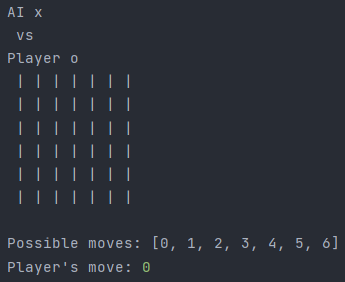

# MinMax Connect Four game
> A text-based ConnectFour game written in Java. 

A simple text-based Connect Four game written in Java. Allows the user to play against another user or against the computer.
The algorithm that drives the computer decisions is the min/max algorithm.

## Screenshots

# How to run
